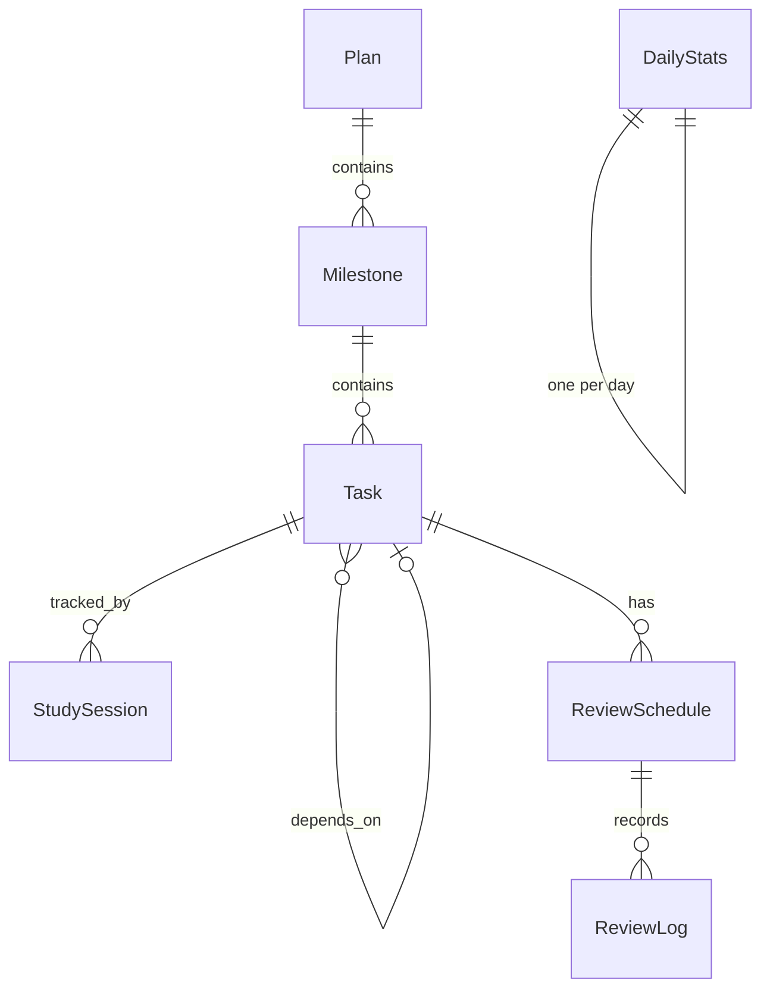

# FocusFlow 技术设计文档（TECH_DESIGN）

> **版本**：v1.0 · **日期**：2026-06-22 · **状态**：Draft · **基于**：PRD v1.0

---

## 1. 架构总览

### 1.1 分层架构

采用 **MVVM + Repository** 模式，四层分离：

```
┌─────────────────────────────────────────────┐
│  UI 层 (Jetpack Compose)                     │
│  Screen → ViewModel → UiState               │
├─────────────────────────────────────────────┤
│  Domain 层 (Use Cases)                       │
│  纯 Kotlin 业务逻辑，不依赖 Android 框架      │
├─────────────────────────────────────────────┤
│  Data 层 (Repository + Room DAO)             │
│  Repository 封装数据源，DAO 访问 SQLite       │
├─────────────────────────────────────────────┤
│  Service 层                                  │
│  TimerService (前台服务) / WorkManager (定时) │
└─────────────────────────────────────────────┘
```

### 1.2 依赖方向

```
UI → Domain → Data
UI → Service（计时器绑定）
Service → Data（写入 Session / 触发通知）
```

UI 层通过 `ViewModel` 调用 `UseCase`，`UseCase` 调用 `Repository`，`Repository` 调用 `DAO`。ViewModel 持有 `StateFlow<UiState>`，Compose 通过 `collectAsStateWithLifecycle()` 订阅（生命周期感知，页面不可见时自动停止收集）。

### 1.3 核心依赖

```kotlin
// build.gradle.kts (project)
plugins {
    id("com.google.dagger.hilt.android") version "2.51.1" apply false
    id("org.jetbrains.kotlin.plugin.serialization") version "2.0.21" apply false
}

// build.gradle.kts (app)
plugins {
    id("com.google.dagger.hilt.android")
    id("org.jetbrains.kotlin.plugin.serialization")
    id("com.google.devtools.ksp")
}

dependencies {
    // Compose
    implementation(platform("androidx.compose:compose-bom:2024.12.01"))
    implementation("androidx.compose.material3:material3")
    implementation("androidx.compose.ui:ui-tooling-preview")
    implementation("androidx.navigation:navigation-compose:2.8.5")

    // Room
    implementation("androidx.room:room-runtime:2.6.1")
    implementation("androidx.room:room-ktx:2.6.1")
    ksp("androidx.room:room-compiler:2.6.1")

    // Hilt (dependency injection)
    implementation("com.google.dagger:hilt-android:2.51.1")
    ksp("com.google.dagger:hilt-android-compiler:2.51.1")
    implementation("androidx.hilt:hilt-navigation-compose:1.2.0")

    // Lifecycle + ViewModel
    implementation("androidx.lifecycle:lifecycle-viewmodel-compose:2.8.7")
    implementation("androidx.lifecycle:lifecycle-runtime-compose:2.8.7")

    // WorkManager
    implementation("androidx.work:work-runtime-ktx:2.10.0")
    implementation("androidx.hilt:hilt-work:1.2.0")
    ksp("androidx.hilt:hilt-compiler:1.2.0")

    // DataStore (用户设置)
    implementation("androidx.datastore:datastore-preferences:1.1.1")

    // Charts
    implementation("com.patrykandpatrick.vico:compose-m3:2.0.0-beta.1")

    // JSON serialization
    implementation("org.jetbrains.kotlinx:kotlinx-serialization-json:1.7.3")

    // Coroutines
    implementation("org.jetbrains.kotlinx:kotlinx-coroutines-android:1.9.0")
}
```

---

## 2. 数据模型

### 2.1 ER 关系图



### 2.2 Room Entity 定义

#### Plan（学习计划）

```kotlin
@Entity(tableName = "plans")
data class Plan(
    @PrimaryKey val id: String,           // UUID
    val title: String,
    val description: String = "",
    val category: String,                 // language|coding|exam|academic|skill|custom
    val startDate: Long,                  // epoch millis
    val endDate: Long,
    val status: String = "draft",         // draft|active|completed|archived
    val coverColor: String = "#4F46E5",   // hex color
    val createdAt: Long = System.currentTimeMillis(),
    val updatedAt: Long = System.currentTimeMillis()
)
```

#### Milestone（里程碑）

```kotlin
@Entity(
    tableName = "milestones",
    foreignKeys = [ForeignKey(
        entity = Plan::class,
        parentColumns = ["id"],
        childColumns = ["planId"],
        onDelete = ForeignKey.CASCADE
    )],
    indices = [Index("planId")]
)
data class Milestone(
    @PrimaryKey val id: String,
    val planId: String,
    val title: String,
    val description: String = "",
    val targetDate: Long? = null,
    val order: Int = 0,
    val status: String = "pending",       // pending|in_progress|completed
    val createdAt: Long = System.currentTimeMillis(),
    val updatedAt: Long = System.currentTimeMillis()
)
```

#### Task（任务）

```kotlin
@Entity(
    tableName = "tasks",
    foreignKeys = [
        ForeignKey(
            entity = Milestone::class,
            parentColumns = ["id"],
            childColumns = ["milestoneId"],
            onDelete = ForeignKey.CASCADE
        ),
        ForeignKey(
            entity = Task::class,
            parentColumns = ["id"],
            childColumns = ["dependsOn"],
            onDelete = ForeignKey.SET_NULL
        )
    ],
    indices = [Index("milestoneId"), Index("dependsOn"), Index("status"), Index("dueDate")]
)
data class Task(
    @PrimaryKey val id: String,
    val milestoneId: String,
    val title: String,
    val description: String = "",
    val estimatedMinutes: Int = 30,
    val actualMinutes: Int = 0,           // 由 Session 汇总写回
    val priority: String = "medium",      // low|medium|high|urgent
    val status: String = "todo",          // todo|in_progress|done|skipped
    val dependsOn: String? = null,        // 前置任务 ID
    val dueDate: Long? = null,
    val completedAt: Long? = null,
    val createdAt: Long = System.currentTimeMillis(),
    val updatedAt: Long = System.currentTimeMillis()
)
```

#### DayAssignment（日计划分配 — 周计划的核心）

```kotlin
@Entity(
    tableName = "day_assignments",
    foreignKeys = [ForeignKey(
        entity = Task::class,
        parentColumns = ["id"],
        childColumns = ["taskId"],
        onDelete = ForeignKey.CASCADE
    )],
    indices = [Index("taskId"), Index("date")]
)
data class DayAssignment(
    @PrimaryKey val id: String,
    val taskId: String,
    val date: Long,                       // epoch millis (当天 00:00)
    val order: Int = 0,                   // 当天排序
    val isTemporary: Boolean = false,     // 日计划临时增删标记
    val createdAt: Long = System.currentTimeMillis()
)
```

#### StudySession（学习记录）

```kotlin
@Entity(
    tableName = "study_sessions",
    foreignKeys = [ForeignKey(
        entity = Task::class,
        parentColumns = ["id"],
        childColumns = ["taskId"],
        onDelete = ForeignKey.CASCADE
    )],
    indices = [Index("taskId"), Index("startTime")]
)
data class StudySession(
    @PrimaryKey val id: String,
    val taskId: String,
    val startTime: Long,                  // epoch millis
    val endTime: Long? = null,
    val durationMinutes: Int = 0,
    val note: String = "",
    val mood: String? = null,             // relaxed|normal|struggling|exhausted
    val createdAt: Long = System.currentTimeMillis()
)
```

#### ReviewSchedule（复习调度）

```kotlin
@Entity(
    tableName = "review_schedules",
    foreignKeys = [ForeignKey(
        entity = Task::class,
        parentColumns = ["id"],
        childColumns = ["taskId"],
        onDelete = ForeignKey.CASCADE
    )],
    indices = [Index("taskId"), Index("nextReviewDate")]
)
data class ReviewSchedule(
    @PrimaryKey val id: String,
    val taskId: String,
    val reviewIntervals: String,          // JSON: [1, 3, 7, 14, 30] 天，可自定义
    val currentRound: Int = 0,            // 当前第几轮复习
    val nextReviewDate: Long,             // 下次复习日期 (epoch millis)
    val lastReviewDate: Long? = null,
    val totalRounds: Int = 5,             // 总轮数
    val status: String = "active",        // active|completed|paused
    val createdAt: Long = System.currentTimeMillis(),
    val updatedAt: Long = System.currentTimeMillis()
)
```

#### ReviewLog（复习日志）

```kotlin
@Entity(
    tableName = "review_logs",
    foreignKeys = [ForeignKey(
        entity = ReviewSchedule::class,
        parentColumns = ["id"],
        childColumns = ["scheduleId"],
        onDelete = ForeignKey.CASCADE
    )],
    indices = [Index("scheduleId")]
)
data class ReviewLog(
    @PrimaryKey val id: String,
    val scheduleId: String,
    val round: Int,                       // 第几轮
    val reviewedAt: Long,                 // epoch millis
    val createdAt: Long = System.currentTimeMillis()
)
```

#### DailyStats（每日统计）

```kotlin
@Entity(tableName = "daily_stats")
data class DailyStats(
    @PrimaryKey val date: Long,           // epoch millis (当天 00:00)
    val totalMinutes: Int = 0,
    val tasksCompleted: Int = 0,
    val reviewsDone: Int = 0,
    val streakDays: Int = 0,
    val updatedAt: Long = System.currentTimeMillis()
)
```

### 2.3 枚举常量

```kotlin
object TaskStatus {
    const val TODO = "todo"
    const val IN_PROGRESS = "in_progress"
    const val DONE = "done"
    const val SKIPPED = "skipped"
}

object Priority {
    const val LOW = "low"
    const val MEDIUM = "medium"
    const val HIGH = "high"
    const val URGENT = "urgent"
}

object PlanStatus {
    const val DRAFT = "draft"
    const val ACTIVE = "active"
    const val COMPLETED = "completed"
    const val ARCHIVED = "archived"
}

object Mood {
    const val RELAXED = "relaxed"
    const val NORMAL = "normal"
    const val STRUGGLING = "struggling"
    const val EXHAUSTED = "exhausted"
}
```

---

## 3. DAO 层（数据访问）

### 3.1 PlanDao

```kotlin
@Dao
interface PlanDao {
    @Query("SELECT * FROM plans WHERE status != 'archived' ORDER BY updatedAt DESC")
    fun getAllPlans(): Flow<List<Plan>>

    @Query("SELECT * FROM plans WHERE id = :id")
    fun getPlanById(id: String): Flow<Plan?>

    @Query("SELECT * FROM plans WHERE status = 'active' ORDER BY updatedAt DESC LIMIT 1")
    fun getActivePlan(): Flow<Plan?>

    @Query("SELECT * FROM plans")
    suspend fun getAllSync(): List<Plan>

    @Insert(onConflict = OnConflictStrategy.REPLACE)
    suspend fun upsert(plan: Plan)

    @Query("UPDATE plans SET status = :status, updatedAt = :now WHERE id = :id")
    suspend fun updateStatus(id: String, status: String, now: Long = System.currentTimeMillis())

    @Delete
    suspend fun delete(plan: Plan)
}
```

### 3.2 MilestoneDao

```kotlin
@Dao
interface MilestoneDao {
    @Query("SELECT * FROM milestones WHERE planId = :planId ORDER BY `order` ASC")
    fun getByPlanId(planId: String): Flow<List<Milestone>>

    @Query("""
        SELECT COUNT(*) as total,
               SUM(CASE WHEN status = 'completed' THEN 1 ELSE 0 END) as completed
        FROM milestones WHERE planId = :planId
    """)
    fun getPlanProgress(planId: String): Flow<ProgressTuple>

    @Insert(onConflict = OnConflictStrategy.REPLACE)
    suspend fun upsert(milestone: Milestone)

    @Query("SELECT * FROM milestones")
    suspend fun getAllSync(): List<Milestone>

    @Delete
    suspend fun delete(milestone: Milestone)
}

data class ProgressTuple(
    @ColumnInfo(name = "total") val total: Int,
    @ColumnInfo(name = "completed") val completed: Int
)

### 3.3 TaskDao

```kotlin
@Dao
interface TaskDao {
    @Query("SELECT * FROM tasks WHERE milestoneId = :milestoneId ORDER BY createdAt ASC")
    fun getByMilestoneId(milestoneId: String): Flow<List<Task>>

    @Query("SELECT * FROM tasks WHERE id = :id")
    suspend fun getById(id: String): Task?

    @Query("SELECT * FROM tasks")
    suspend fun getAllSync(): List<Task>

    @Query("""
        SELECT t.* FROM tasks t
        INNER JOIN day_assignments da ON da.taskId = t.id
        WHERE da.date = :date AND t.status != 'skipped'
        ORDER BY da.`order` ASC
    """)
    fun getTasksForDate(date: Long): Flow<List<Task>>

    @Query("""
        SELECT t.* FROM tasks t
        INNER JOIN milestones m ON m.id = t.milestoneId
        INNER JOIN plans p ON p.id = m.planId
        WHERE p.status = 'active' AND t.status = 'todo'
        ORDER BY
            CASE t.priority WHEN 'urgent' THEN 0 WHEN 'high' THEN 1
                            WHEN 'medium' THEN 2 ELSE 3 END,
            t.dueDate ASC NULLS LAST
    """)
    fun getTodayRecommended(): Flow<List<Task>>

    @Query("SELECT COUNT(*) FROM tasks WHERE milestoneId = :milestoneId AND status = 'done'")
    fun getCompletedCount(milestoneId: String): Flow<Int>

    @Query("SELECT COUNT(*) FROM tasks WHERE milestoneId = :milestoneId")
    fun getTotalCount(milestoneId: String): Flow<Int>

    /** 检查前置依赖任务是否已完成（用于 UI 灰显） */
    @Query("SELECT status FROM tasks WHERE id = :taskId")
    fun getTaskStatus(taskId: String): Flow<String?>

    @Insert(onConflict = OnConflictStrategy.REPLACE)
    suspend fun upsert(task: Task)

    @Query("UPDATE tasks SET status = :status, completedAt = :completedAt, updatedAt = :now WHERE id = :id")
    suspend fun updateStatus(id: String, status: String, completedAt: Long? = null, now: Long = System.currentTimeMillis())

    @Query("UPDATE tasks SET actualMinutes = :minutes, updatedAt = :now WHERE id = :id")
    suspend fun updateActualMinutes(id: String, minutes: Int, now: Long = System.currentTimeMillis())

    @Delete
    suspend fun delete(task: Task)
}
```

### 3.4 DayAssignmentDao

```kotlin
@Dao
interface DayAssignmentDao {
    @Query("SELECT * FROM day_assignments WHERE date = :date ORDER BY `order` ASC")
    fun getByDate(date: Long): Flow<List<DayAssignment>>

    @Query("SELECT * FROM day_assignments WHERE date BETWEEN :weekStart AND :weekEnd")
    fun getByWeek(weekStart: Long, weekEnd: Long): Flow<List<DayAssignment>>

    @Query("SELECT COUNT(*) FROM day_assignments WHERE date = :date")
    fun getCountForDate(date: Long): Flow<Int>

    @Insert(onConflict = OnConflictStrategy.REPLACE)
    suspend fun upsert(assignment: DayAssignment)

    @Query("DELETE FROM day_assignments WHERE taskId = :taskId AND date = :date")
    suspend fun removeTaskFromDate(taskId: String, date: Long)

    @Query("DELETE FROM day_assignments WHERE id = :id")
    suspend fun delete(id: String)

    @Query("SELECT * FROM day_assignments")
    suspend fun getAllSync(): List<DayAssignment>
}
```

### 3.5 StudySessionDao

```kotlin
@Dao
interface StudySessionDao {
    @Query("SELECT * FROM study_sessions WHERE taskId = :taskId ORDER BY startTime DESC")
    fun getByTaskId(taskId: String): Flow<List<StudySession>>

    @Query("""
        SELECT * FROM study_sessions
        WHERE startTime BETWEEN :dayStart AND :dayEnd
        ORDER BY startTime ASC
    """)
    fun getByDateRange(dayStart: Long, dayEnd: Long): Flow<List<StudySession>>

    @Query("""
        SELECT COALESCE(SUM(durationMinutes), 0) FROM study_sessions
        WHERE startTime BETWEEN :dayStart AND :dayEnd
    """)
    fun getTotalMinutesForDay(dayStart: Long, dayEnd: Long): Flow<Int>

    @Query("""
        SELECT COALESCE(SUM(durationMinutes), 0) FROM study_sessions
        WHERE startTime BETWEEN :weekStart AND :weekEnd
    """)
    fun getTotalMinutesForWeek(weekStart: Long, weekEnd: Long): Flow<Int>

    @Insert(onConflict = OnConflictStrategy.REPLACE)
    suspend fun upsert(session: StudySession)

    @Query("UPDATE study_sessions SET endTime = :endTime, durationMinutes = :duration WHERE id = :id")
    suspend fun finish(id: String, endTime: Long, duration: Int)

    @Query("SELECT * FROM study_sessions")
    suspend fun getAllSync(): List<StudySession>
}
```

### 3.6 ReviewScheduleDao

```kotlin
@Dao
interface ReviewScheduleDao {
    @Query("""
        SELECT * FROM review_schedules
        WHERE nextReviewDate <= :today AND status = 'active'
        ORDER BY nextReviewDate ASC
    """)
    fun getDueReviews(today: Long): Flow<List<ReviewSchedule>>

    @Query("""
        SELECT * FROM review_schedules
        WHERE nextReviewDate BETWEEN :rangeStart AND :rangeEnd AND status = 'active'
    """)
    fun getReviewsForRange(rangeStart: Long, rangeEnd: Long): Flow<List<ReviewSchedule>>

    @Query("SELECT COUNT(*) FROM review_schedules WHERE nextReviewDate <= :today AND status = 'active'")
    fun getDueReviewCount(today: Long): Flow<Int>

    @Query("SELECT * FROM review_schedules")
    suspend fun getAllSync(): List<ReviewSchedule>

    @Insert(onConflict = OnConflictStrategy.REPLACE)
    suspend fun upsert(schedule: ReviewSchedule)

    @Query("""
        UPDATE review_schedules
        SET currentRound = currentRound + 1,
            nextReviewDate = :nextDate,
            lastReviewDate = :now,
            status = CASE WHEN currentRound + 1 >= totalRounds THEN 'completed' ELSE 'active' END,
### 3.7 DailyStatsDao

```kotlin
@Dao
interface DailyStatsDao {
    @Query("SELECT * FROM daily_stats WHERE date = :date")
    fun getByDate(date: Long): Flow<DailyStats?>

    @Query("SELECT * FROM daily_stats WHERE date = :date")
    suspend fun getByDateSync(date: Long): DailyStats?

    @Query("SELECT * FROM daily_stats WHERE date BETWEEN :from AND :to ORDER BY date ASC")
    fun getDateRange(from: Long, to: Long): Flow<List<DailyStats>>

    @Query("SELECT * FROM daily_stats ORDER BY date DESC LIMIT :limit")
    fun getRecent(limit: Int): Flow<List<DailyStats>>

    @Query("SELECT * FROM daily_stats")
    suspend fun getAllSync(): List<DailyStats>

    @Insert(onConflict = OnConflictStrategy.REPLACE)
    suspend fun upsert(stats: DailyStats)
}
```

### 3.8 ReviewLogDao

```kotlin
@Dao
interface ReviewLogDao {
    @Insert(onConflict = OnConflictStrategy.REPLACE)
    suspend fun upsert(log: ReviewLog)

    @Query("SELECT * FROM review_logs WHERE scheduleId = :scheduleId ORDER BY reviewedAt DESC")
    fun getByScheduleId(scheduleId: String): Flow<List<ReviewLog>>

    @Query("SELECT * FROM review_logs")
    suspend fun getAllSync(): List<ReviewLog>
}
```

---

## 4. Repository 层

Repository 仅封装 DAO 调用，不含跨表业务逻辑。跨表编排（如完成任务时汇总 Session 时长）由 Domain 层 UseCase 负责。

### 4.1 TaskRepository

```kotlin
class TaskRepository(
    private val taskDao: TaskDao,
    private val assignmentDao: DayAssignmentDao
) {
    fun getTasksForDate(date: Long): Flow<List<Task>> =
        taskDao.getTasksForDate(date)

    fun getRecommendedTasks(): Flow<List<Task>> =
        taskDao.getTodayRecommended()

    suspend fun getTaskById(id: String): Task? =
        taskDao.getById(id)

    suspend fun updateTaskStatus(id: String, status: String, completedAt: Long? = null) =
        taskDao.updateStatus(id, status, completedAt)

    suspend fun updateActualMinutes(id: String, minutes: Int) =
        taskDao.updateActualMinutes(id, minutes)

    suspend fun assignTaskToDay(taskId: String, date: Long) {
        assignmentDao.upsert(DayAssignment(
            id = UUID.randomUUID().toString(),
            taskId = taskId,
            date = date
        ))
    }
}
```

### 4.2 CompleteTaskUseCase（示例）

```kotlin
/**
 * 完成任务的业务编排：更新状态 + 汇总 Session 时长写回。
 * ViewModel 调用此 UseCase，而非直接调用 Repository。
 */
class CompleteTaskUseCase(
    private val taskRepository: TaskRepository,
    private val sessionDao: StudySessionDao
) {
    suspend operator fun invoke(taskId: String) {
        val now = System.currentTimeMillis()
        taskRepository.updateTaskStatus(taskId, TaskStatus.DONE, now)
        // 汇总该任务所有 Session 的实际时长
        // val totalMinutes = sessionDao.getTotalMinutesForTask(taskId).first()
        // taskRepository.updateActualMinutes(taskId, totalMinutes)
    }
}
```

### 4.3 ReviewRepository

```kotlin
class ReviewRepository(
    private val scheduleDao: ReviewScheduleDao,
    private val reviewLogDao: ReviewLogDao
) {
    fun getDueReviews(): Flow<List<ReviewSchedule>> {
        val today = LocalDate.now().toEpochMillis()
        return scheduleDao.getDueReviews(today)
    }

    suspend fun createSchedule(taskId: String, intervals: List<Int> = listOf(1, 3, 7, 14, 30)) {
        val schedule = ReviewSchedule(
            id = UUID.randomUUID().toString(),
            taskId = taskId,
            reviewIntervals = Json.encodeToString(intervals),
            nextReviewDate = LocalDate.now().plusDays(intervals[0].toLong()).toEpochMillis(),
            totalRounds = intervals.size
        )
        scheduleDao.upsert(schedule)
    }

    suspend fun markReviewed(scheduleId: String) {
        val schedule = scheduleDao.getById(scheduleId) ?: return
        val intervals = Json.decodeFromString<List<Int>>(schedule.reviewIntervals)
        val nextRound = schedule.currentRound + 1
        val nextDate = if (nextRound < intervals.size) {
            LocalDate.now().plusDays(intervals[nextRound].toLong()).toEpochMillis()
        } else {
            // 所有轮次完成
            Long.MAX_VALUE
        }
        scheduleDao.markReviewed(scheduleId, nextDate)

        // 写入复习日志
        reviewLogDao.upsert(ReviewLog(
            id = UUID.randomUUID().toString(),
            scheduleId = scheduleId,
            round = nextRound,
            reviewedAt = System.currentTimeMillis()
        ))
    }
}
```
### 4.4 StreakRepository

```kotlin
class StreakRepository(
    private val statsDao: DailyStatsDao,
    private val prefs: DataStore<Preferences>
) {
    /**
     * 计算当前连续学习天数。
     * 从今天往回数，遇到 totalMinutes < MIN_STREAK_MINUTES (5) 的天就断开。
     * 冻结日跳过不计。
     */
    suspend fun calculateStreak(): Int {
        val freezeUsedThisMonth = prefs.data.first()[FREEZE_USED_KEY] ?: 0
        val freezeLimit = prefs.data.first()[FREEZE_LIMIT_KEY] ?: 2
        var streak = 0
        var freezesRemaining = freezeLimit - freezeUsedThisMonth
        var date = LocalDate.now()

        while (true) {
            val stats = statsDao.getByDateSync(date.toEpochMillis())
            when {
                stats != null && stats.totalMinutes >= 5 -> streak++
                freezesRemaining > 0 -> freezesRemaining--  // 使用冻结
                else -> break
            }
            date = date.minusDays(1)
        }
        return streak
    }

    companion object {
        const val MIN_STREAK_MINUTES = 5
    }
}
```

---

## 5. Service 层

### 5.1 TimerService（前台服务）

计时器必须在锁屏/切后台时持续运行。使用 Android Foreground Service。

```kotlin
class TimerService : Service() {
    private val binder = TimerBinder()
    private var startTime: Long = 0L
    private var pausedAt: Long = 0L
    private var isPaused: Boolean = false
    private var elapsedSeconds: Int = 0
    private val _elapsed = MutableStateFlow(0)
    val elapsed: StateFlow<Int> = _elapsed  // 秒数

    private val handler = Handler(Looper.getMainLooper())
    private val tickRunnable = object : Runnable {
        override fun run() {
            if (!isPaused) {
                elapsedSeconds = ((System.currentTimeMillis() - startTime) / 1000).toInt()
                _elapsed.value = elapsedSeconds
            }
            handler.postDelayed(this, 1000)
        }
    }

    override fun onStartCommand(intent: Intent?, flags: Int, startId: Int): Int {
        when (intent?.action) {
            ACTION_START -> startTimer()
            ACTION_PAUSE -> pauseTimer()
            ACTION_RESUME -> resumeTimer()
            ACTION_STOP -> stopTimer()
        }
        return START_STICKY
    }

    private fun startTimer() {
        startTime = System.currentTimeMillis()
        isPaused = false
        startForeground(NOTIFICATION_ID, buildNotification("学习中..."))
        handler.post(tickRunnable)
    }

    private fun pauseTimer() {
        pausedAt = System.currentTimeMillis()
        isPaused = true
    }

    private fun resumeTimer() {
        startTime += System.currentTimeMillis() - pausedAt
        isPaused = false
    }

    private fun stopTimer() {
        handler.removeCallbacks(tickRunnable)
        stopForeground(STOP_FOREGROUND_REMOVE)
        stopSelf()
    }

    private fun buildNotification(text: String): Notification {
        val channel = NotificationChannel(CHANNEL_ID, "学习计时", NotificationManager.IMPORTANCE_LOW)
        getSystemService(NotificationManager::class.java).createNotificationChannel(channel)
        return NotificationCompat.Builder(this, CHANNEL_ID)
            .setContentTitle("FocusFlow")
            .setContentText(text)
            .setSmallIcon(R.drawable.ic_timer)
### 5.2 ReviewReminderWorker（WorkManager 定时任务）

```kotlin
class ReviewReminderWorker(
    context: Context,
    params: WorkerParameters
) : CoroutineWorker(context, params) {

    override suspend fun doWork(): Result {
        val today = LocalDate.now().toEpochMillis()
        val db = FocusFlowDatabase.getInstance(applicationContext)
        val dueCount = db.reviewScheduleDao().getDueReviewCount(today).first()

        if (dueCount > 0) {
            sendNotification(
                title = "复习提醒",
                message = "你有 $dueCount 项待复习内容"
            )
        }
        return Result.success()
    }

    private fun sendNotification(title: String, message: String) {
        val nm = applicationContext.getSystemService(NotificationManager::class.java)
        val channel = NotificationChannel("review_channel", "复习提醒", NotificationManager.IMPORTANCE_DEFAULT)
        nm.createNotificationChannel(channel)
        val notification = NotificationCompat.Builder(applicationContext, "review_channel")
            .setContentTitle(title)
            .setContentText(message)
            .setSmallIcon(R.drawable.ic_review)
            .setAutoCancel(true)
            .build()
        nm.notify(2, notification)
    }

    companion object {
        /** 计算距离目标提醒时间（默认 09:00）的毫秒延迟 */
        private fun calculateDelayToTarget(targetHour: Int = 9): Long {
            val now = LocalDateTime.now()
            var target = now.toLocalDate().atTime(targetHour, 0)
            if (now.isAfter(target)) {
                target = target.plusDays(1)  // 明天的目标时间
            }
            return Duration.between(now, target).toMillis()
        }

        fun schedule(context: Context) {
            val request = PeriodicWorkRequestBuilder<ReviewReminderWorker>(
                1, TimeUnit.DAYS
            ).setInitialDelay(calculateDelayToTarget(), TimeUnit.MILLISECONDS)
             .build()

            WorkManager.getInstance(context).enqueueUniquePeriodicWork(
                "review_reminder",
                ExistingPeriodicWorkPolicy.KEEP,
                request
            )
        }
    }
}
```

---

## 6. ViewModel 层

### 6.1 DashboardViewModel（仪表盘）

```kotlin
@HiltViewModel
class DashboardViewModel @Inject constructor(
    private val taskRepository: TaskRepository,
    private val streakRepository: StreakRepository,
    private val sessionRepository: SessionRepository,
    private val statsDao: DailyStatsDao
) : ViewModel() {

    data class UiState(
        val streakDays: Int = 0,
        val todayMinutes: Int = 0,
        val todayTasks: List<Task> = emptyList(),
        val completedTasks: Int = 0,
        val totalTasks: Int = 0,
        val weekMinutes: Int = 0,
        val weekTasksCompleted: Int = 0,
        val weekTasksTotal: Int = 0,
        val heatmapData: Map<Long, Int> = emptyMap() // date → minutes
    )

    private val _uiState = MutableStateFlow(UiState())
    val uiState: StateFlow<UiState> = _uiState.asStateFlow()

    init {
        // 并行收集多个 Flow
        viewModelScope.launch {
            combine(
                taskRepository.getTasksForDate(todayEpoch()),
                sessionRepository.getTotalMinutesForDay(todayStart(), todayEnd()),
                streakRepository.observeStreak()
            ) { tasks, minutes, streak ->
                Triple(tasks, minutes, streak)
            }.collect { (tasks, minutes, streak) ->
                _uiState.update {
                    it.copy(
                        streakDays = streak,
                        todayMinutes = minutes,
                        todayTasks = tasks,
                        completedTasks = tasks.count { t -> t.status == TaskStatus.DONE },
                        totalTasks = tasks.size
                    )
                }
            }
        }
    }
}
```

### 6.2 TimerViewModel

```kotlin
@HiltViewModel
class TimerViewModel @Inject constructor(
    private val sessionRepository: SessionRepository,
    private val taskRepository: TaskRepository
) : ViewModel() {

    data class UiState(
        val isRunning: Boolean = false,
        val isPaused: Boolean = false,
        val elapsedSeconds: Int = 0,
        val currentTaskId: String? = null,
        val currentSessionId: String? = null
    )

    private val _uiState = MutableStateFlow(UiState())
    val uiState: StateFlow<UiState> = _uiState.asStateFlow()

    fun startTimer(taskId: String) {
        val sessionId = UUID.randomUUID().toString()
        _uiState.update { it.copy(isRunning = true, currentTaskId = taskId, currentSessionId = sessionId) }
        // 绑定 TimerService，收集 elapsed flow
    }

    fun pauseTimer() {
        _uiState.update { it.copy(isPaused = true) }
        // 调用 TimerService.pause()
    }

    fun resumeTimer() {
        _uiState.update { it.copy(isPaused = false) }
        // 调用 TimerService.resume()
    }

    fun stopTimer() {
        val state = _uiState.value
        viewModelScope.launch {
            sessionRepository.finishSession(
                sessionId = state.currentSessionId!!,
                taskId = state.currentTaskId!!,
                durationMinutes = state.elapsedSeconds / 60
            )
            _uiState.update { UiState() } // reset
        }
    }
}
```

---

## 7. 导航设计

### 7.1 路由定义

```kotlin
sealed class Screen(val route: String) {
    data object Dashboard : Screen("dashboard")
    data object DailyReview : Screen("daily_review")  // 每日回顾弹窗/页面
    data object PlanList : Screen("plan_list")
    data object PlanDetail : Screen("plan/{planId}") {
        fun createRoute(planId: String) = "plan/$planId"
    }
    data object Timer : Screen("timer")
    data object Review : Screen("review")
    data object Settings : Screen("settings")
}
```

### 7.2 底部导航栏

```kotlin
@Composable
fun MainNavHost() {
    val navController = rememberNavController()
    Scaffold(
        bottomBar = {
            NavigationBar {
                val items = listOf(
                    Triple(Screen.Dashboard, Icons.Default.Home, "仪表盘"),
                    Triple(Screen.PlanList, Icons.Default.List, "计划"),
                    Triple(Screen.Timer, Icons.Default.Timer, "计时"),
                    Triple(Screen.Review, Icons.Default.DateRange, "复习"),
                    Triple(Screen.Settings, Icons.Default.Person, "我的"),
                )
                items.forEach { (screen, icon, label) ->
                    NavigationBarItem(
                        icon = { Icon(icon, label) },
                        label = { Text(label) },
                        selected = currentRoute == screen.route,
                        onClick = { navController.navigate(screen.route) }
                    )
                }
            }
        }
    ) { padding ->
        NavHost(navController, Screen.Dashboard.route, Modifier.padding(padding)) {
            composable(Screen.Dashboard.route) { DashboardScreen() }
            composable(Screen.DailyReview.route) { DailyReviewScreen() }
            composable(Screen.PlanList.route) { PlanListScreen() }
            composable(Screen.PlanDetail.route) { backStack ->
                val planId = backStack.arguments?.getString("planId")!!
                PlanDetailScreen(planId)
            }
            composable(Screen.Timer.route) { TimerScreen() }
            composable(Screen.Review.route) { ReviewScreen() }
            composable(Screen.Settings.route) { SettingsScreen() }
        }
    }
}
```

---

## 8. 关键技术方案

### 8.1 Streak 计算逻辑

```kotlin
/**
 * Streak 判定规则：
 * - 每日学习 ≥ 5 分钟 = 有效打卡
 * - 从今天往回连续数，遇到无效天 → 检查冻结额度 → 有额度则跳过，无额度则断开
 * - 冻结额度按自然月重置，默认每月 2 次
 * - 时区：使用设备本地时区
 * - 午夜边界：以 00:00 为日切分点
 */
object StreakCalculator {
    const val MIN_MINUTES = 5

    fun calculate(
        dailyStats: List<DailyStats>,   // 按日期降序
        freezeUsed: Int,
        freezeLimit: Int
    ): Int {
        var streak = 0
        var freezesLeft = freezeLimit - freezeUsed
        for (stats in dailyStats) {
            if (stats.totalMinutes >= MIN_MINUTES) {
                streak++
            } else if (freezesLeft > 0) {
                freezesLeft--
                // 冻结日不计入 streak，但不中断
            } else {
                break
            }
        }
        return streak
    }
}
```

### 8.2 复习调度算法

```kotlin
/**
 * 复习间隔采用自定义周期数组（默认 [1, 3, 7, 14, 30] 天）。
 *
 * 打卡时：
 *   currentRound++ → nextReviewDate = today + intervals[currentRound]
 *   若 currentRound >= intervals.size → status = "completed"
 *
 * 漏复习时：
 *   不重置，下次打开时仍显示在待复习列表中
 *   用户补复习后正常推进
 */
object ReviewScheduler {
    fun nextReviewDate(currentRound: Int, intervals: List<Int>): LocalDate {
        val days = intervals.getOrElse(currentRound) { intervals.last() }
        return LocalDate.now().plusDays(days.toLong())
    }

    fun isCompleted(currentRound: Int, totalRounds: Int): Boolean =
        currentRound >= totalRounds
}
```

### 8.3 数据导入/导出

```kotlin
/**
 * 导出格式：JSON 文件，包含 schema 版本号 + 全量数据
 * 导入策略：覆盖现有数据，需用户确认
 * 版本兼容：通过 schemaVersion 字段判断是否可导入
 */
@Serializable
data class BackupData(
    val schemaVersion: Int = 1,
    val exportedAt: Long,
    val plans: List<Plan>,
    val milestones: List<Milestone>,
    val tasks: List<Task>,
    val dayAssignments: List<DayAssignment>,
    val studySessions: List<StudySession>,
    val reviewSchedules: List<ReviewSchedule>,
    val reviewLogs: List<ReviewLog>,
    val dailyStats: List<DailyStats>
)

class BackupManager(private val db: FocusFlowDatabase) {
    suspend fun exportToJson(context: Context): Uri {
        val data = BackupData(
            exportedAt = System.currentTimeMillis(),
            plans = db.planDao().getAllSync(),
            milestones = db.milestoneDao().getAllSync(),
            tasks = db.taskDao().getAllSync(),
            dayAssignments = db.dayAssignmentDao().getAllSync(),
            studySessions = db.studySessionDao().getAllSync(),
            reviewSchedules = db.reviewScheduleDao().getAllSync(),
            reviewLogs = db.reviewLogDao().getAllSync(),
            dailyStats = db.dailyStatsDao().getAllSync()
        )
        val json = Json.encodeToString(data)
        return writeToFile(context, "focusflow_backup_${dateStr}.json", json)
    }

    suspend fun importFromJson(context: Context, uri: Uri): Boolean {
        val json = context.contentResolver.openInputStream(uri)?.bufferedReader()?.readText() ?: return false
        val data = Json.decodeFromString<BackupData>(json)
        if (data.schemaVersion > CURRENT_VERSION) return false

        db.withTransaction {
            db.clearAllTables()
            data.plans.forEach { db.planDao().upsert(it) }
            data.milestones.forEach { db.milestoneDao().upsert(it) }
            data.tasks.forEach { db.taskDao().upsert(it) }
            data.dayAssignments.forEach { db.dayAssignmentDao().upsert(it) }
            data.studySessions.forEach { db.studySessionDao().upsert(it) }
            data.reviewSchedules.forEach { db.reviewScheduleDao().upsert(it) }
            data.reviewLogs.forEach { db.reviewLogDao().upsert(it) }
            data.dailyStats.forEach { db.dailyStatsDao().upsert(it) }
        }
        return true
    }
}
```

### 8.4 热力图数据查询

```kotlin
/**
 * 热力图需要最近 N 周每天的学习分钟数。
 * 直接从 daily_stats 表查询，不实时计算 session。
 */
fun getHeatmapData(weeks: Int = 16): Flow<Map<Long, Int>> {
    val from = LocalDate.now().minusWeeks(weeks.toLong()).toEpochMillis()
    val to = System.currentTimeMillis()
    return statsDao.getDateRange(from, to).map { statsList ->
        statsList.associate { it.date to it.totalMinutes }
    }
}
```

---

## 9. 项目目录结构（详细）

```
app/src/main/java/com/focusflow/
├── FocusFlowApp.kt                          # Application 类
├── MainActivity.kt                          # 唯一 Activity
│
├── di/                                      # 依赖注入（Hilt）
│   └── AppModule.kt                         # 提供 DB / Repository / DAO
│
├── navigation/
│   └── AppNavigation.kt                     # NavHost + 底部 Tab
│
├── data/
│   ├── db/
│   │   ├── FocusFlowDatabase.kt             # @Database 定义
│   │   ├── entity/                          # 所有 @Entity 类
│   │   │   ├── Plan.kt
│   │   │   ├── Milestone.kt
│   │   │   ├── Task.kt
│   │   │   ├── DayAssignment.kt
│   │   │   ├── StudySession.kt
│   │   │   ├── ReviewSchedule.kt
│   │   │   ├── ReviewLog.kt
│   │   │   └── DailyStats.kt
│   │   ├── dao/                             # 所有 @Dao 接口
│   │   │   ├── PlanDao.kt
│   │   │   ├── MilestoneDao.kt
│   │   │   ├── TaskDao.kt
│   │   │   ├── DayAssignmentDao.kt
│   │   │   ├── StudySessionDao.kt
│   │   │   ├── ReviewScheduleDao.kt
│   │   │   ├── ReviewLogDao.kt
│   │   │   └── DailyStatsDao.kt
│   │   └── converter/
│   │       └── Converters.kt                # Room TypeConverters
│   ├── repository/
│   │   ├── PlanRepository.kt
│   │   ├── TaskRepository.kt
│   │   ├── SessionRepository.kt
│   │   ├── ReviewRepository.kt
│   │   ├── StreakRepository.kt
│   │   └── StatsRepository.kt
│   └── backup/
│       └── BackupManager.kt                 # JSON 导入/导出
│
├── domain/
│   ├── model/                               # 业务模型（可选，与 Entity 分离）
│   └── usecase/                             # 用例
│       ├── GetTodayTasksUseCase.kt
│       ├── CompleteTaskUseCase.kt
│       ├── CalculateStreakUseCase.kt
│       └── GetReviewScheduleUseCase.kt
│
├── ui/
│   ├── theme/
│   │   ├── Color.kt
│   │   ├── Type.kt
│   │   └── Theme.kt                         # Material 3 主题
│   ├── components/                          # 共享组件
│   │   ├── StreakBadge.kt
│   │   ├── ProgressBar.kt
│   │   ├── HeatmapCalendar.kt
│   │   ├── TaskCard.kt
│   │   └── PriorityChip.kt
│   ├── dashboard/
│   │   ├── DashboardScreen.kt
│   │   └── DashboardViewModel.kt
│   ├── plan/
│   │   ├── PlanListScreen.kt
│   │   ├── PlanDetailScreen.kt
│   │   ├── WeeklyPlanScreen.kt
│   │   ├── DailyPlanScreen.kt
│   │   └── PlanViewModel.kt
│   ├── timer/
│   │   ├── TimerScreen.kt
│   │   └── TimerViewModel.kt
│   ├── review/
│   │   ├── ReviewScreen.kt
│   │   ├── ReviewCalendarScreen.kt
│   │   └── ReviewViewModel.kt
│   └── settings/
│       ├── SettingsScreen.kt
│       └── SettingsViewModel.kt
│
├── service/
│   ├── TimerService.kt                      # 前台服务
│   └── ReviewReminderWorker.kt              # WorkManager
│
└── util/
    ├── DateUtils.kt                         # 日期工具
    ├── StreakCalculator.kt                  # Streak 计算
    └── ReviewScheduler.kt                   # 复习调度
```

---

## 10. 权限清单

```xml
<manifest>
    <!-- 计时器前台服务 -->
    <uses-permission android:name="android.permission.FOREGROUND_SERVICE" />
    <uses-permission android:name="android.permission.FOREGROUND_SERVICE_SPECIAL_USE" />

    <!-- 通知（Android 13+ 需运行时申请） -->
    <uses-permission android:name="android.permission.POST_NOTIFICATIONS" />

    <!-- 文件导出（Scoped Storage，无需额外权限） -->

    <!-- v0.3 AI 摘要（可选） -->
    <!-- <uses-permission android:name="android.permission.INTERNET" /> -->
</manifest>
```
